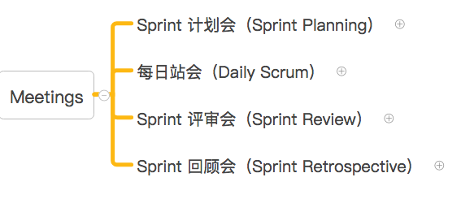

title: 敏捷项目管理浅见  
speaker: 时扬扬
theme: dark
files: assets/css/font-awesome.css
from: https://www.zhihu.com/question/19638322

[slide]
# 敏捷项目管理 (Scrum)
<small>演讲者: 时扬扬</small>

[slide]
# 敏捷项目管理目的
## （一）适应变化
> Scrum 的一个基本假设，就是外部需求模糊而难以理解。
> Scrum 对此的理念是：让客户直接看到半成品，他们才知道自己要什么。
> 完整的项目有时候是对资源的浪费

[slide]
# 敏捷项目管理目的
## （二）快速迭代
> Scrum 的另一个基本假设，激烈的团队竞争导致快速的产品功能。
> Scrum 对此的理念是：发布即 Milestone（里程碑），宁可每次发布20个功能，也不要积攒100个功能一次性发布。

[slide]
# 敏捷项目管理目的
## （三）打磨团队
> 团队是项目的主体，每个团队都有自己的特色。
> 在团队协作中磨合，为面临更多的挑战做好基础。

[slide data-transition="vertical3d"]
# [敏捷软件开发宣言](http://agilemanifesto.org/iso/zhchs/manifesto.html)
1. 个体和互动 高于 流程和工具
1. 工作的软件 高于 详尽的文档
1. 客户合作 高于 合同谈判
1. 响应变化 高于 遵循计划

[slide data-transition="zoomin"]
# 敏捷软件开发角色

[slide data-transition="newspaper"]
# 四个会议

